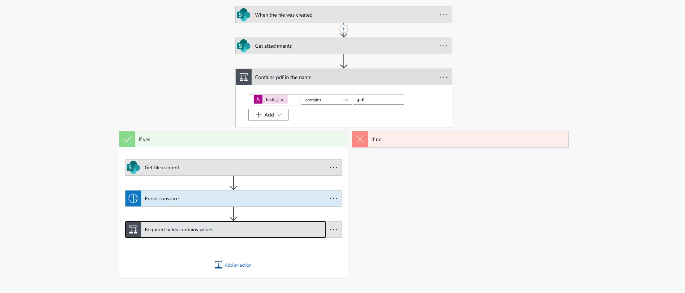
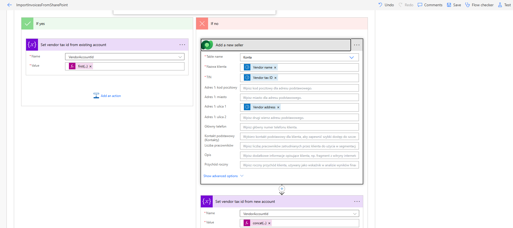

🧩 Projekt: Invoice Processing Automation (Power Platform)

Description:

Automation of invoice processing using:

- Power Automate
- Power Apps
- Microsoft Dataverse
- AI Builder

⚙️ What the system does

1. Retrieves an invoice from SharePoint
2. Extracts data using AI Builder
3. Validates data (Expressions)
4. Saves data to Dataverse
5. Sends notifications (Email)
6. Enables editing in Power Apps

🏗️ Architektura

Power Automate → AI Builder → Dataverse → Power Apps

📸 Screenshots

⚙️ Flow (Power Automate)

➕ Add a new account

➕ Add a new invoice

✉️ Send email

💡 Challenges

- mapping nested JSON from AI Builder
- inserting a new contact into the standard customer field. I had to add a custom expression.

🔮 Possible extensions

- Azure Functions (C# fallback)
- CI/CD (ALM)
- ERP integration

🏁 Overview:

This project focused on automating invoice processing using the Power Platform ecosystem, including Power Automate, Power Apps, Microsoft Dataverse, and AI Builder. The goal was to streamline data extraction, validation, and management while reducing manual effort.
